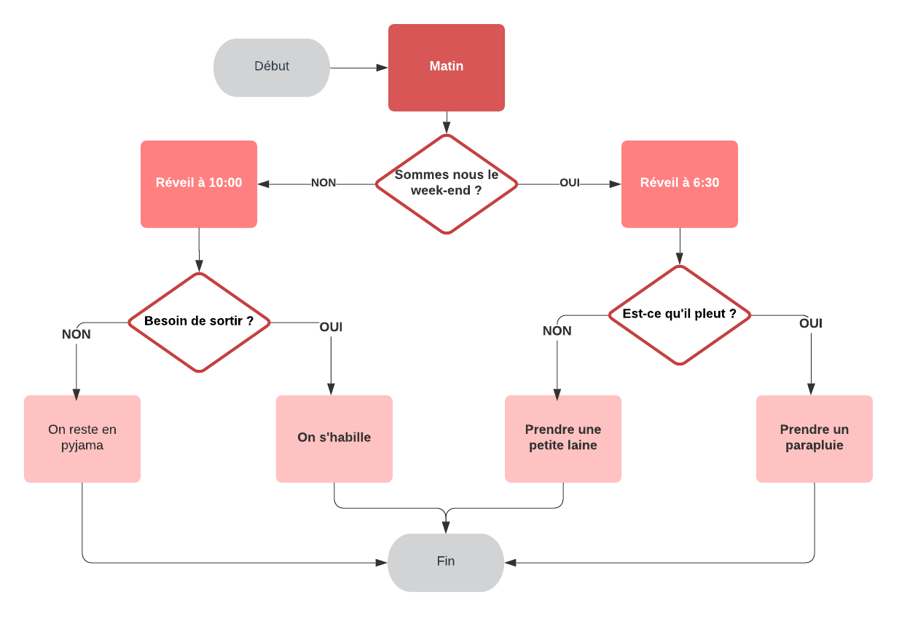

# Introduction aux instructions conditionnelles

Imaginez que vous vous réveillez le matin.

Vous vous demandez : « Ugh. C'est un jour de semaine ? »

Si oui, vous devez vous lever, vous habiller et vous préparer pour l'université. Sinon, vous pouvez faire la grasse matinée un peu plus longtemps et grappiller quelques heures supplémentaires.

Mais hélas, c'est un jour de semaine ; vous êtes debout et habillé, puis vous regardez dehors : « Quel temps fait‑il ? Ai‑je besoin d'un parapluie ? »



Ces **questions et décisions contrôlent le déroulement** de votre matinée : chaque étape et résultat est un produit des conditions du jour et de votre environnement.

Votre ordinateur, tout comme vous, passe par un **flux similaire chaque fois qu'il exécute un code**. Un programme s'exécute (se « réveille ») et commence à passer par ses listes de contrôle : telle condition est‑elle remplie ? telle autre ? Exécutons ce code et renvoyons cette valeur.

C'est le flux de contrôle de votre programme. En **C**, votre script s'exécute de haut en bas, jusqu'à ce qu'il n'y ait plus rien à exécuter. À vous d'inclure des passerelles, appelées **instructions conditionnelles**, pour indiquer à l'ordinateur quand exécuter certains blocs de code. Si ces conditions sont remplies, alors exécuter cette portion de code.

---

# Instruction `if`

Une instruction `if` teste une expression et exécute du code en fonction de son résultat. Forme simple :

```c
if (condition) {
  // code à exécuter
}
```

Si la condition vaut **1** (vrai), les instructions contenues sont exécutées. Sinon (condition vaut **0**, faux), elles sont ignorées et le programme continue.

```c
if (montant_compte == 0) {
  printf("J'ai plus un radis 😭😭\n");
}
```

Le mot‑clé `if` est suivi d'un ensemble de parenthèses `()`.

À l'intérieur des parenthèses, une condition est évaluée à **1** ou **0** :

- Si la condition vaut **1**, le code à l'intérieur des accolades `{}` s'exécute.
- Si la condition vaut **0**, le code ne s'exécute pas.

Ainsi, ci‑dessus, si `montant_compte` est égal à `0`, le programme affiche « J'ai plus un radis 😭😭 » ; sinon, rien ne se passe et l'exécution continue.

## À vous de jouer ! 🧩🎮

### Mise en place

1. Récupérez le squelette de la fonction avec sa bibliothèque :
    ```c
    #include <stdio.h>

    int main(void)
    {
        // Votre code ci‑dessous

        return 0;
    }
    ```

2. Créez une variable entière `note_programmation` et assignez‑la à `12`.

3. À la suite, **écrivez** une instruction `if` où, si `note_programmation < 9` est vraie (vaut `1`), on affiche `"Note insuffisante"`.

   <details>
   <summary>J'ai besoin d'aide ! 😱</summary>
   <p>

   Modèle de l'instruction :

   ```c
   if (condition) {
     // code
   }
   ```

   Exemple :

   ```c
   if (note_programmation > 10) {
     printf("Note suffisante\n");
   }
   ```

   </p>
   </details>

---

# Les opérateurs relationnels

Pour composer des conditions, on utilise des **opérateurs relationnels** :

- `==` égal à
- `!=` différent de
- `>` supérieur à
- `<` inférieur à
- `>=` supérieur ou égal à
- `<=` inférieur ou égal à

Les opérateurs comparent la valeur de gauche avec la valeur de droite.

## À vous de jouer ! 🧩🎮

1. Reprenez le code de l'exercice précédent.
2. Remplacez la condition `note_programmation > 10` par `note_programmation < 10`. Que va‑t‑il se passer ?

   <details>
   <summary>J'ai besoin d'aide ! 😱</summary>
   <p>
   Le code devrait maintenant ressembler à ceci :
   </p>

   ```c
   if (note_programmation < 10) {
     printf("Note insuffisante\n");
   }
   ```

   <p>
   Rien ne s'affiche : `note_programmation` vaut `12`, donc la condition `note_programmation < 10` vaut `0` (faux). Le code à l'intérieur ne s'exécute pas.
   </p>
   </details>

3. Remplacez `note_programmation < 10` par `note_programmation != 10`. À votre avis, que se passera‑t‑il ?

   <details>
   <summary>J'ai besoin d'aide ! 😱</summary>
   <p>

   ```c
   if (note_programmation != 10) {
     printf("Note suffisante\n");
   }
   ```

   `Note suffisante` s'affiche ! La note vaut `12`, donc `note_programmation != 10` vaut `1` (vrai).
   </p>
   </details>

---

# Instruction `else`

On peut ajouter une clause `else` (sinon) à une instruction `if` pour fournir du code **exécuté seulement si la condition du `if` vaut 0**.

```c
if (condition) {
  // Instruction 1
} else {
  // Instruction 2
}
```

- Si `condition` vaut **1**, l'instruction 1 s'exécute, puis le programme poursuit après le bloc `if/else`.
- Si `condition` vaut **0**, l'instruction 1 est ignorée et l'instruction 2 s'exécute.

```c
if (cote_piece == 0) {
  printf("Pile\n");
} else {
  printf("Face\n");
}
```

Ainsi, si `cote_piece` vaut `0`, le programme affiche `Pile` ; sinon, il affiche `Face`.

*Remarque : c'est l'un **ou** l'autre — un seul des deux blocs s'exécute !*

## À vous de jouer ! 🧩🎮

1. Créez un nouveau programme.
2. À la première ligne, incluez la bibliothèque standard pour les entrées/sorties.

   <details>
   <summary>J'ai besoin d'aide ! 😱</summary>
   <p>

   ```c
   #include <stdio.h>
   ```
   </p>
   </details>

3. Créez la fonction principale avec ses accolades.

   <details>
   <summary>J'ai besoin d'aide ! 😱</summary>
   <p>

   ```c
   int main(void) {
     // Votre code ci‑dessous
     return 0;
   }
   ```

   </p>
   </details>

4. Déclarez et **initialisez** une variable entière `nombre_a_tester` à `8`.

   <details>
   <summary>J'ai besoin d'aide ! 😱</summary>
   <p>

   ```c
   int nombre_a_tester = 8;
   ```

   </p>
   </details>

5. Écrivez une **instruction `if`** : si le reste de la division euclidienne vaut `0` (`nombre_a_tester % 2 == 0`), afficher `"Le nombre est pair"`.

   <details>
   <summary>J'ai besoin d'aide ! 😱</summary>
   <p>

   ```c
   if (nombre_a_tester % 2 == 0) {
     printf("Le nombre est pair.\n");
   }
   ```

   </p>
   </details>

6. Ajoutez une **instruction `else`** qui affiche `"Le nombre est impair"`.

---

# `else if` (sinon si)

Pour gérer **plus de deux** résultats possibles :

```c
if (condition1) {
  // code pour la condition 1
} else if (condition2) {
  // code pour la condition 2
} else {
  // code si aucune condition n'est remplie
}
```

`else if` vient après `if` et avant `else`. Vous pouvez en chaîner plusieurs :

```c
if (age == 1) {
  printf("Bébé\n");
} else if (age == 5) {
  printf("Enfant\n");
} else if (age == 12) {
  printf("Adolescent\n");
} else if (age == 18) {
  printf("Adulte\n");
} else {
  printf("Senior\n");
}
```

## À vous de jouer ! 🧩🎮

1. Nouveau brouillon.
2. Incluez la bibliothèque standard pour les entrées/sorties.

   <details>
   <summary>J'ai besoin d'aide ! 😱</summary>
   <p>

   ```c
   #include <stdio.h>
   ```
   </p>
   </details>

3. Créez la fonction principale avec ses accolades.

   <details>
   <summary>J'ai besoin d'aide ! 😱</summary>
   <p>

   ```c
   int main(void) {
     // Votre code ci‑dessous
     return 0;
   }
   ```

   </p>
   </details>

4. Déclarez et initialisez une variable flottante `ph` à `4.8`.

   <details>
   <summary>J'ai besoin d'aide ! 😱</summary>
   <p>

   ```c
   double ph = 4.8;
   ```

   </p>
   </details>

En chimie, le pH spécifie l'acidité ou la basicité d'une solution aqueuse.

5. Écrivez des conditions **`if`, `else if`, `else`** :
   - Si `ph > 7` : afficher `"Solution basique"`.
   - Si `ph < 7` : afficher `"Solution acide"`.
   - Sinon : afficher `"Solution neutre"`.

   <details>
   <summary>J'ai besoin d'aide ! 😱</summary>
   <p>

   ```c
   #include <stdio.h>

   int main(void) {
     double ph = 4.8;

     if (ph > 7) {
       printf("Solution basique\n");
     } else if (ph < 7) {
       printf("Solution acide\n");
     } else {
       printf("Solution neutre\n");
     }

     return 0;
   }
   ```

   </p>
   </details>

---

# Instruction d'aiguillage `switch`

Pour les programmes à multiples issues, **C** propose l'instruction `switch`, une alternative lisible à une suite de `if/else if`.

```c
int jour = 5;
switch (jour) {
  case 1:
    printf("Lundi\n");
    break;
  case 2:
    printf("Mardi\n");
    break;
  case 3:
    printf("Mercredi\n");
    break;
  case 4:
    printf("Jeudi\n");
    break;
  case 5:
    printf("Vendredi\n");
    break;
  case 6:
    printf("Samedi\n");
    break;
  case 7:
    printf("Dimanche\n");
    break;
  default:
    printf("Jour inconnu\n");
}
// Affiche "Vendredi" (jour = 5)
```

- `switch` est suivi de `()` contenant l'expression comparée dans chaque cas (doit être de **type intégral** : `int`, `char`, `short`, `long`, `long long` ou `enum`).
- Chaque `case` vérifie si l'expression correspond à la valeur indiquée.
- `break` fait sortir du bloc `switch`.
- `default` est exécuté si aucun cas ne correspond.

**Remarque** : sans `break`, le programme **enchaîne (fall‑through)** le code du premier cas correspondant **et** tous les cas suivants, y compris `default`.

## À vous de jouer ! 🧩🎮

La SNCF vous recrute pour écrire un petit programme d'aiguillage des départs de train selon leur identifiant.

1. Créez un nouveau programme vierge.
2. Incluez la bibliothèque standard des entrées/sorties.

   <details>
   <summary>J'ai besoin d'aide ! 😱</summary>
   <p>

   ```c
   #include <stdio.h>
   ```
   </p>
   </details>

3. Créez la fonction principale avec ses accolades.

   <details>
   <summary>J'ai besoin d'aide ! 😱</summary>
   <p>

   ```c
   int main(void) {
     // Votre code ci‑dessous
     return 0;
   }
   ```

   </p>
   </details>

4. Créez une variable entière `id_train` et **initialisez‑la** à `889415`.

   <details>
   <summary>J'ai besoin d'aide ! 😱</summary>
   <p>

   ```c
   int id_train = 889415;
   ```

   </p>
   </details>

5. Créez une instruction `switch` sur `id_train` avec 3 cas :
   - `5103` → afficher `"Destination MARSEILLE"`
   - `6603` → afficher `"Destination PERRACHE"`
   - `default` → afficher `"Destination GRENOBLE"`

   <details>
   <summary>J'ai besoin d'aide ! 😱</summary>
   <p>

   ```c
   switch (id_train) {
     case 5103:
       printf("Destination MARSEILLE\n");
       break;
     case 6603:
       printf("Destination PERRACHE\n");
       break;
     default:
       printf("Destination GRENOBLE\n");
       break;
   }
   ```

   </p>
   </details>

6. Compilez et exécutez.
7. Ajoutez 1 cas juste avant `default` :
   - `889415` → afficher `"Destination ROANNE"`

   <details>
   <summary>J'ai besoin d'aide ! 😱</summary>
   <p>

   ```c
   switch (id_train) {
     case 5103:
       printf("Destination MARSEILLE\n");
       break;
     case 6603:
       printf("Destination PERRACHE\n");
       break;
     case 889415:
       printf("Destination ROANNE\n");
       break;
     default:
       printf("Destination GRENOBLE\n");
       break;
   }
   ```

   </p>
   </details>

8. Re-compilez et exécutez.

---

# Opérateurs logiques

Souvent, une seule condition ne suffit pas. Les **opérateurs logiques** permettent de **combiner** des conditions. Le résultat est un entier interprété comme booléen : **1** (vrai) ou **0** (faux).

Nous verrons trois opérateurs :
- `&&` : **ET** logique
- `||` : **OU** logique
- `!`  : **NON** logique

## Table de vérité — ET (`&&`)

| a | b | a && b |
|---|---|--------|
| 0 | 0 |   0    |
| 0 | 1 |   0    |
| 1 | 0 |   0    |
| 1 | 1 |   1    |

On a besoin que **les deux** opérandes vaillent `1` pour obtenir `1`.

## Table de vérité — OU (`||`)

| a | b | a \|\| b |
|---|---|---------|
| 0 | 0 |    0    |
| 0 | 1 |    1    |
| 1 | 0 |    1    |
| 1 | 1 |    1    |

Ici, **une seule** des deux conditions à `1` suffit.

## Table de vérité — NON (`!`)

| a | !a |
|---|----|
| 0 |  1 |
| 1 |  0 |

👉 Pour plus d'infos sur l'algèbre de Boole : <https://fr.wikipedia.org/wiki/Alg%C3%A8bre_de_Boole_(logique)>

---

## Opérateur logique **ET** : `&&`

Il renvoie `1` si **la condition de gauche ET la condition de droite** valent `1`. Sinon, le résultat vaut `0`.

Exemples :
- `(1 < 2 && 2 < 3)` renvoie `1`
- `(1 < 2 && 2 > 3)` renvoie `0`

### À vous de jouer ! 🧩🎮

1. Créez un nouvel espace de travail vierge.
2. Incluez la bibliothèque standard des entrées/sorties.

   <details>
   <summary>J'ai besoin d'aide ! 😱</summary>
   <p>

   ```c
   #include <stdio.h>
   ```
   </p>
   </details>

3. Créez la fonction principale avec ses accolades.

   <details>
   <summary>J'ai besoin d'aide ! 😱</summary>
   <p>

   ```c
   int main(void) {
     // Votre code ci‑dessous
     return 0;
   }
   ```

   </p>
   </details>

4. Déclarez et initialisez **deux** variables entières `bien_bu` et `bien_mange` à `1`.

   <details>
   <summary>J'ai besoin d'aide ! 😱</summary>
   <p>

   ```c
   int bien_bu = 1, bien_mange = 1;
   ```

   </p>
   </details>

5. Écrivez l'instruction `if` suivante : si `bien_bu` vaut `1` **et** `bien_mange` vaut `1`, afficher « J'ai la peau du ventre bien tendu ».

   <details>
   <summary>J'ai besoin d'aide ! 😱</summary>
   <p>

   ```c
   if (bien_bu == 1 && bien_mange == 1) {
     printf("J'ai la peau du ventre bien tendu\n");
   }
   ```

   </p>
   </details>

6. Compilez et exécutez.

---

## Opérateur logique **OU** : `||`

Il renvoie `1` lorsque **la condition de gauche vaut `1` ou la condition de droite vaut `1`**. Une seule des deux suffit.

Exemples :
- `(1 < 2 || 2 > 3)` renvoie `1`
- `(1 > 2 || 2 > 3)` renvoie `0`

### À vous de jouer ! 🧩🎮

1. Créez un nouvel espace de travail vierge.
2. Incluez la bibliothèque standard des entrées/sorties.

   <details>
   <summary>J'ai besoin d'aide ! 😱</summary>
   <p>

   ```c
   #include <stdio.h>
   ```
   </p>
   </details>

3. Créez la fonction principale avec ses accolades.

   <details>
   <summary>J'ai besoin d'aide ! 😱</summary>
   <p>

   ```c
   int main(void) {
     // Votre code ci‑dessous
     return 0;
   }
   ```

   </p>
   </details>

4. Déclarez et initialisez **une** variable entière `jour_semaine` à `7`.

   <details>
   <summary>J'ai besoin d'aide ! 😱</summary>
   <p>

   ```c
   int jour_semaine = 7;
   ```

   </p>
   </details>

5. Écrivez l'instruction `if` suivante : si le jour de la semaine est égal à `6` **ou** égal à `7`, afficher « C'est le week‑end !! ».

   <details>
   <summary>J'ai besoin d'aide ! 😱</summary>
   <p>

   *En C, utilisez `||`. (Le mot‑clé alternatif `or` est standard en C++ ; en C il nécessite `<iso646.h>`.)*

   ```c
   if (jour_semaine == 6 || jour_semaine == 7) {
     printf("C'est le week‑end !!\n");
   }
   ```

   </p>
   </details>

6. Compilez et exécutez.

---

## Opérateur logique **NON** : `!`

`!` inverse le résultat booléen (0/1) de l'expression qui suit immédiatement.

Exemples :
- `!1` renvoie `0`
- `!0` renvoie `1`
- `!(10 < 11)` renvoie `0`

### À vous de jouer ! 🧩🎮

1. Créez un espace de travail vierge.
2. Incluez la bibliothèque standard des entrées/sorties.

   <details>
   <summary>J'ai besoin d'aide ! 😱</summary>
   <p>

   ```c
   #include <stdio.h>
   ```
   </p>
   </details>

3. Créez la fonction principale avec ses accolades.

   <details>
   <summary>J'ai besoin d'aide ! 😱</summary>
   <p>

   ```c
   int main(void) {
     // Votre code ci‑dessous
     return 0;
   }
   ```

   </p>
   </details>

4. Déclarez et initialisez **une** variable entière `mot_de_passe_saisi` à `0`.

   <details>
   <summary>J'ai besoin d'aide ! 😱</summary>
   <p>

   ```c
   int mot_de_passe_saisi = 0;
   ```

   </p>
   </details>

5. Écrivez l'instruction `if` suivante : si le mot de passe **n'est pas** saisi, afficher `"Veuillez saisir le mot de passe"`.

   <details>
   <summary>J'ai besoin d'aide ! 😱</summary>
   <p>

   ```c
   if (!mot_de_passe_saisi) {
     printf("Veuillez saisir le mot de passe\n");
   }
   ```

   </p>
   </details>

6. Compilez et exécutez.

---

# Opérateur ternaire

L'instruction `if/else` est si courante que **C** propose un raccourci pour l'écrire sur une seule ligne : l'**opérateur ternaire**.

```c
condition ? expression_si : expression_sinon;
```

Équivalent à :

```c
if (condition) {
  // expression_si
} else {
  // expression_sinon
}
```

Exemple (minimum de deux nombres) :

```c
if (a < b) {
  min = a;
} else {
  min = b;
}
// devient
min = (a < b) ? a : b;
```

Exemple complet :

```c
#include <stdio.h>

int main(void) {
  int a = 10;
  int b = 5;
  int min;

  // Stocke puis affiche le plus petit
  min = (a < b) ? a : b;
  printf("%d\n", min);

  // Affiche directement le plus petit
  (a < b) ? printf("%d\n", a) : printf("%d\n", b);

  return 0;
}
```

Second exemple :

```c
#include <stdio.h>

int main(void) {
  int num = 5;
  printf("Le nombre %d est %s\n", num, (num % 2 == 0) ? "pair" : "impair");
  return 0;
}
```

### À vous de jouer ! 🧩🎮

Copiez‑collez le code ci‑dessous dans votre éditeur pour prendre en main l'opérateur ternaire :

```c
#include <stdio.h>

int main(void) {
  int age = 25;
  float tarif;
  tarif = (age < 18) ? 6.5f : (age < 60) ? 10.0f : 8.0f;
  printf("Le tarif pour cette personne est de %.2f euros\n", tarif);
  return 0;
}
```
